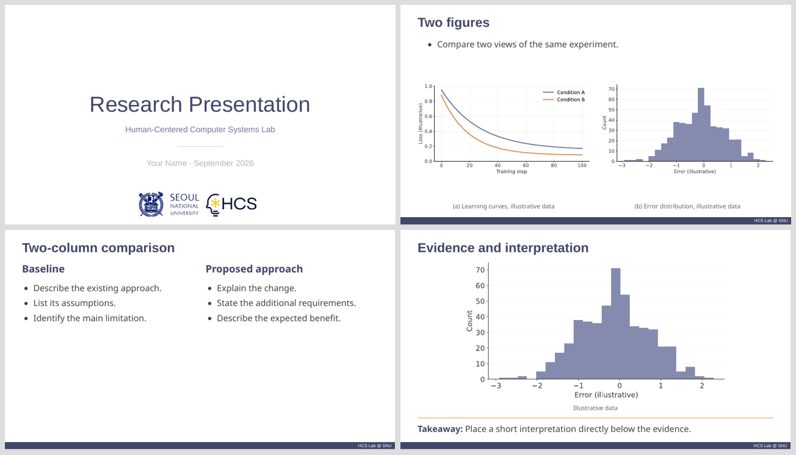

# HCS Slidev Template

A [Slidev](https://sli.dev/) presentation template for the **Human-Centered Computer Systems Lab at Seoul National University**.

The theme follows the HCS PowerPoint format: a 16:9 canvas, navy headings and section slides, the lab footer, and the original SNU and HCS logos. Write slide content in Markdown and manage the presentation in Git.



## Setup (macOS and Linux)

1. Install [Node.js](https://nodejs.org/en/download) **22.12 or later** and [VS Code](https://code.visualstudio.com/). npm is included with Node.js. If using nvm, run `nvm install` in this repository to use the version in `.nvmrc`.
2. Open the repository folder in VS Code, then install the locked project dependencies in its integrated terminal:

   ```sh
   PLAYWRIGHT_SKIP_BROWSER_DOWNLOAD=1 npm ci
   ```

   Preview and website builds do not need Chromium. A global Slidev CLI installation is unnecessary; the project includes its own version.
3. Install the recommended [Slidev extension](https://marketplace.visualstudio.com/items?itemName=antfu.slidev) (`antfu.slidev`).
4. Open `slides.md`, select the **Slidev** sidebar, and start the preview. Use the extension's preview controls to view slides inside VS Code or in your browser.

The extension starts a development server in the terminal with:

```sh
npm exec -c 'slidev "slides.md" --port 3030'
```

No custom extension command is required. Run this command from the repository folder if starting the server manually. The browser preview is available at **http://localhost:3030**. Saving Markdown, theme files, or assets updates the preview automatically.

The workspace excludes Slidev entry files from markdownlint because Slidev uses multiple top-level headings, frontmatter, Vue components, and inline HTML as presentation syntax. Regular Markdown files such as this README are still checked.

Stop the server with **Ctrl+C in its terminal** when finished. Closing a browser tab does not stop the server. Use one preview server at a time; do not also run `npm run dev` while the extension's server is running.

## Create a presentation

`slides.md` is a minimal presentation ready to edit. Replace its title, author, and content to begin your talk. The complete layout gallery is available in `layouts.md`; open that file with the Slidev extension, or run `npm run dev:layouts` to page through it on port 3031. Every slide in it names the layout that produced it, so copy a slide out of the file rather than writing frontmatter from memory.

Separate slides with `---` and select a layout in the slide's frontmatter:

```md
---
layout: text-image
ratio: 0.9fr 1.1fr
---

# Research results

::text::

- Describe the main observation.
- Highlight the **key interpretation**.

::image::
<HcsFigure src="/figures/result.png" alt="Experimental results" caption="Figure 1. Experimental results" />
```

Place images in `public/figures/` and reference them as `/figures/filename`. `HcsFigure` preserves the full image and its aspect ratio. Add `fit="cover"` only when intentional cropping is appropriate.

For another entry file in the repository root:

```sh
npm exec -c 'slidev "talk.md" --port 3030'
```

Stop an existing preview first. The theme path is relative to the entry file.

## Layouts

| Layout | Content slots | Typical use |
| --- | --- | --- |
| `cover` | default, `subtitle`, `author` | Title, affiliation, presenter |
| `default` | default | Bullets, tables, equations, references |
| `section` | default | Section divider |
| `figure` | default, `figure` | Text above one figure |
| `two-figures` | default, `left`, `right` | Text above two figures |
| `text-image` | default, `text`, `image` | Explanation beside a figure |
| `two-cols` | default, `left`, `right` | Baseline/proposal, pros/cons, two text columns |
| `statement` | default, `support` | One takeaway or research question |
| `full-figure` | default | Large image or diagram with a caption |
| `result` | default, `figure`, `takeaway` | Evidence with a short interpretation below |
| `end` | default | Closing slide |

The default slot holds the heading and introductory text, except in `full-figure`, where it holds an `HcsFigure`. Named slots use `::slot-name::` syntax. See `layouts.md` for complete examples.

For `text-image`, set `imageSide: left` to put the image first. The `ratio` option on `text-image` and `two-cols` controls **left and right** column widths, such as `1fr 1fr` or `2fr 1fr`.

Layouts do not automatically shrink text. Split dense content across slides instead of reducing font size.

## Clicks, arrows, and equations

Reveal content on a specific click:

```md
<v-click at="1">

- Reveal this observation on the first click.

</v-click>

<v-click at="2">

- Add the <mark>main interpretation</mark> on the second click.

</v-click>
```

Place an arrow inside a figure:

```html
<HcsFigure src="/figures/result.png" alt="Experimental results">
  <HcsArrow v-click="1" :x1="25" :y1="20" :x2="70" :y2="60" />
</HcsFigure>
```

Arrow coordinates range from 0 to 100 across the **figure container**, including any space around an uncropped image. Set `color="#d46a26"` to change the arrow color. Use arrow keys to advance through click steps.

Inline math uses `$...$`; display equations use `$$...$$`. Equations are rendered with KaTeX. English and Korean text are supported.

## Theme customization

Edit the variables at the top of `theme/styles/hcs.css` to change the entire presentation:

```css
:root {
  --hcs-heading: #424769;
  --hcs-title-size: 32px;
  --hcs-body-size: 21.333px;
  --hcs-gap: 28px;
}
```

The template maps the source deck's 720 × 405 pt canvas to 960 × 540 CSS pixels. Keep `canvasWidth: 960` and `aspectRatio: 16/9` in the presentation headmatter.

Headings prefer Helvetica Neue, with fallbacks on other operating systems. Noto Sans and Noto Sans KR are bundled through npm, so the preview does not fetch Google Fonts. To make heading typography consistent across macOS and Linux, set `--hcs-title-font` to `'Noto Sans', 'Noto Sans KR', sans-serif`. Browser typography may differ slightly from PowerPoint.

Set `number: true` on an ordinary content slide to show its page number. Set `footer: 'Your footer'` to override the default footer.

## Build and export

```sh
# Static website in dist/
npm run build

# Website hosted under a subpath
npm run build -- --base /repository-name/
```

Building does not publish the presentation. Upload or deploy `dist/` separately.

For PDF or PowerPoint export, install Chromium once:

```sh
# macOS
npx playwright install chromium

# Linux (also installs required system libraries; may request sudo)
npx playwright install --with-deps chromium
```

Then export:

```sh
npm run export        # PDF: exports/slides.pdf
npm run export:steps  # PDF with a page for each click step
npm run export:pptx   # Image-based PowerPoint: exports/slides.pptx
```

Browser presentations retain interactions. PDFs are static; `export:steps` expands clicks into separate pages. PPTX slides are images, not editable text and shapes, and clicks become separate slides rather than PowerPoint animations.

## Repository structure

```text
slides.md             Presentation to edit
layouts.md            Complete layout gallery
theme/layouts/        Reusable slide layouts
theme/components/     Branding, figures, and arrows
theme/styles/hcs.css   Shared design tokens and styles
theme/assets/         Original SNU and HCS logo assets
public/figures/       Presentation images and example figures
.vscode/              Slidev extension recommendation and entry files
.nvmrc                Node.js version for nvm
```

Commit Markdown, theme files, source assets, and the lockfile. Exclude `node_modules/`, `dist/`, and `exports/`. For larger presentations, split content into files and include them with Slidev's `src` frontmatter.

## Troubleshooting

- **`slidev: command not found`:** run `PLAYWRIGHT_SKIP_BROWSER_DOWNLOAD=1 npm ci` in the repository folder. Ensure development dependencies are installed; do not use `--omit=dev`.
- **`node` or `npm` is unavailable in VS Code:** check `node --version` and `npm --version` in its integrated terminal. Restart VS Code after installing Node.js or changing your shell's PATH.
- **Port 3030 is occupied:** an existing preview may still be running. Stop it in its terminal before starting another preview. For a manual server on another port, run `npm exec -c 'slidev "slides.md" --port 3031'`.
- **Changes do not appear:** save the file and confirm that the extension started the correct entry file from this repository.
- **`EMFILE` / too many file watchers:** stop the preview and run `CHOKIDAR_USEPOLLING=1 npm run dev` in the integrated terminal, then open the browser preview. This enables polling at the cost of extra CPU usage.
- **Dependencies changed after pulling updates:** stop the preview, rerun `PLAYWRIGHT_SKIP_BROWSER_DOWNLOAD=1 npm ci`, and start it again.

## Assets

SNU and HCS marks remain the property of their respective owners. Example charts use synthetic data and do not represent research findings.
