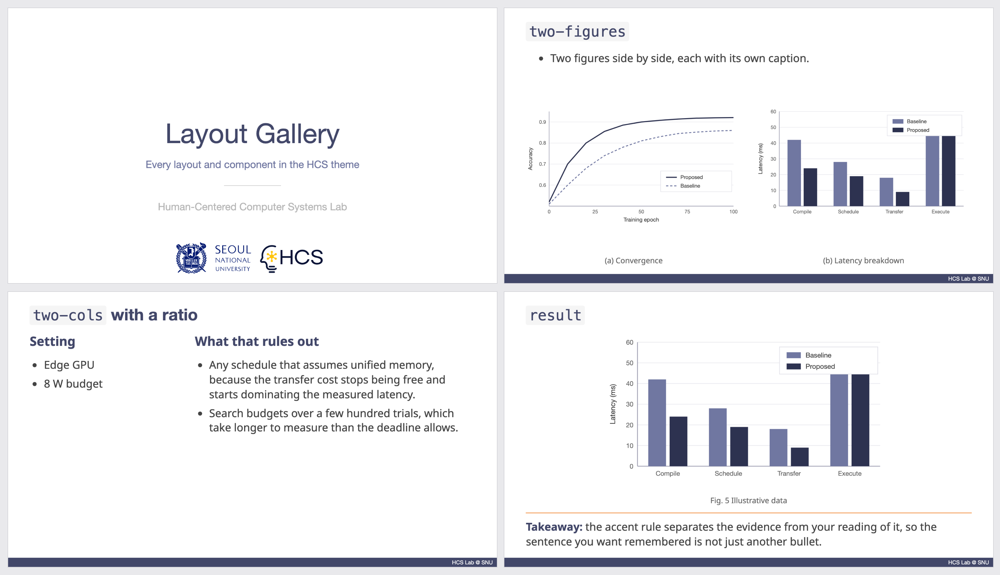

# slidev-theme-hcs

A [Slidev](https://sli.dev/) theme for the **Human-Centered Computer Systems Lab
at Seoul National University**.

It follows the HCS PowerPoint format: a 16:9 canvas, navy headings and section
slides, the lab footer, and the original SNU and HCS marks. You write the talk in
Markdown and keep it in Git.



## Start a talk

```sh
npx degit snuhcs/slidev-theme-hcs/starter my-talk
cd my-talk
npm install
npm run dev
```

`starter/` is a complete deck: `slides.md` in the lab format, a `package.json`
that pulls in Slidev and this theme, `public/figures/` for your images, and a
`.vscode/` that recommends the Slidev extension. Open the folder in VS Code and
press play in the Slidev sidebar, or run `npm run dev` yourself.

`degit` copies the folder without any git history, so `git init` afterwards
gives you a clean repository for your own talk.

## Add the theme to a deck you already have

```sh
npm i -D github:snuhcs/slidev-theme-hcs
```

Then two lines of frontmatter on the first slide:

```md
---
theme: hcs
title: My talk
---

# My talk
```

That is the whole headmatter. The theme sets the aspect ratio, canvas width,
color scheme, and fonts, so decks do not repeat them and cannot drift apart.
Slidev resolves the name `hcs` to the `slidev-theme-hcs` package in
`node_modules`, so nothing in a deck refers to this repository by path.

Pin a release if a deck has to keep rendering the same way forever:

```sh
npm i -D github:snuhcs/slidev-theme-hcs#v1.0.0
```

and pull later fixes with `npm update slidev-theme-hcs`.

New to Slidev itself? Its [documentation](https://sli.dev/) covers writing,
presenting, and exporting. This theme changes none of that — only how the
slides look.

## See every layout

**[docs/gallery.md](docs/gallery.md) shows every slide of `example.md` as an
image**, each one labelled with the layout that produced it. It is the fastest
way to find the layout you want.

`example.md` itself is the source those images come from, so copy slides out of
it rather than writing frontmatter from memory. To page through it live:

```sh
git clone https://github.com/snuhcs/slidev-theme-hcs
cd slidev-theme-hcs
npm install
npm run dev
```

## Layouts

| Layout | Content slots | Typical use |
| --- | --- | --- |
| `cover` | default, `subtitle`, `author` | Title, affiliation, presenter |
| `default` | default | Bullets, tables, equations, references |
| `agenda` | default | Outline, and the "where we are" slide between sections |
| `section` | default | Section divider |
| `figure` | default, `figure` | Text above one figure |
| `two-figures` | default, `left`, `right` | Text above two figures |
| `figures` | default, `figures` | Three or more figures in one row |
| `text-image` | default, `text`, `image` | Explanation beside a figure |
| `two-cols` | default, `left`, `right` | Baseline/proposal, pros/cons, two text columns |
| `statement` | default, `support` | One takeaway or research question |
| `full-figure` | default | Large image or diagram with a caption |
| `result` | default, `figure`, `takeaway` | Evidence with a short interpretation below |
| `end` | default | Closing slide |

The default slot holds the heading and introductory text, except in
`full-figure`, where it holds an `HcsFigure`. Named slots use `::slot-name::`.

For `text-image`, `imageSide: left` puts the image first. The `ratio` option on
`text-image` and `two-cols` sets the two column widths, such as `1fr 1fr` or
`2fr 1fr`. `figures` spaces its panels evenly; `cols` overrides that with
explicit widths, as in `cols: 1.3fr 1fr 1fr`.

`agenda` is a roomier list than `default`. Write the items yourself, or drop in
Slidev's built-in `<Toc columns="2" />` to build them from the slide titles.

Layouts do not shrink text to fit. Split dense content across slides instead of
reducing the font size.

Per slide, `number: true` shows that slide's page number and
`footer: 'Your footer'` overrides the default footer.

## Components

- `HcsFigure` — a figure with a caption. `src`, `alt`, `caption`, and `fit`
  (`contain` by default, `cover` to fill and crop).
- `HcsArrow` — an arrow drawn over a figure. Put it inside `HcsFigure` and give
  `x1`, `y1`, `x2`, `y2` on a 0–100 grid over the figure container, including
  any empty space around an uncropped image. `color` changes the stroke.
- `HcsBrand` — the SNU and HCS logos. The `cover`, `section`, and `end` layouts
  place it already; you rarely write it yourself.
- `HcsFrame` — the white slide frame with the footer, used by every content
  layout.

```md
<HcsFigure src="/figures/result.png" alt="Experimental results" caption="Fig. 1">
  <HcsArrow v-click="1" :x1="25" :y1="20" :x2="70" :y2="60" />
</HcsFigure>
```

## Figures

Put images in your deck's own `public/` and reference them from the root:

```text
my-talk/
  slides.md
  public/figures/result.png   ->  <HcsFigure src="/figures/result.png" ... />
```

`HcsFigure` resolves a leading `/` against the deck's base path, so the same
path works under the dev server and under a site deployed at a subpath.
`HcsFigure` never crops: it fits the whole image into the space available. Use
`fit="cover"` only when cropping is deliberate.

## Customization

The design tokens live at the top of `styles/hcs.css`:

```css
:root {
  --hcs-heading: #424769;
  --hcs-title-size: 32px;
  --hcs-body-size: 21.333px;
  --hcs-gap: 28px;
}
```

The theme maps the source deck's 720 × 405 pt canvas to 960 × 540 CSS pixels.

Headings prefer Helvetica Neue and fall back on other systems. Noto Sans and
Noto Sans KR ship with the theme through `@fontsource`, so a deck never fetches
Google Fonts. For heading typography that is identical on macOS and Linux, set
`--hcs-title-font` to `'Noto Sans', 'Noto Sans KR', sans-serif`.

If a change would help everyone, open an
[issue](https://github.com/snuhcs/slidev-theme-hcs/issues) or a pull request
rather than editing a copy inside your own deck — a copy stops receiving fixes.

## Developing the theme

```text
layouts/          one .vue per layout
components/       HcsFigure, HcsArrow, HcsBrand, HcsFrame
styles/           hcs.css design tokens, index.ts font imports
assets/           SNU and HCS logo files
example.md        the deck that documents the theme
public/figures/   figures used by example.md
starter/          the deck folder a new talk starts from
docs/gallery.md   generated: every slide of example.md as an image
```

```sh
npm run dev       # example.md at http://localhost:3030
npm run build     # static build of example.md
npm run export    # exports/example.pdf, needs Chromium
npm run gallery   # re-render docs/gallery/ and screenshot.png
```

Add a layout by dropping a `.vue` file in `layouts/`, then add a slide for it to
`example.md`, add a row to the table above, and run `npm run gallery`. A layout
that is not in `example.md` is a layout nobody will find.

## Assets and license

The theme code is MIT licensed. The SNU and HCS marks in `assets/` remain the
property of their respective owners and are included for lab use. Example charts
use synthetic data and do not represent research results.
